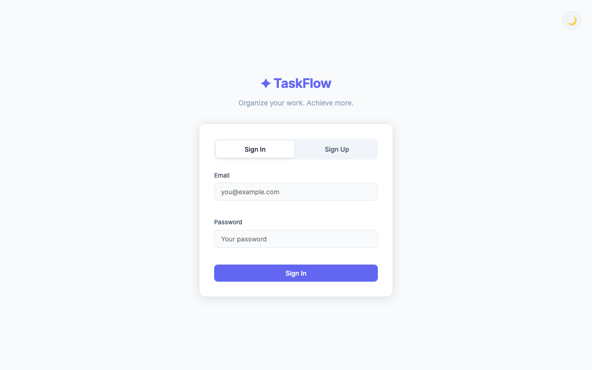
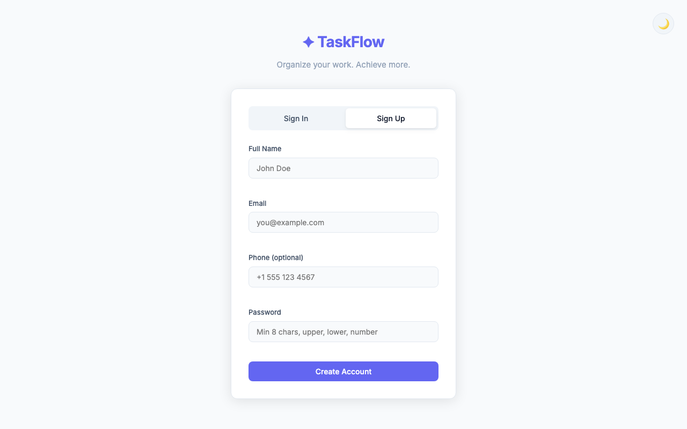
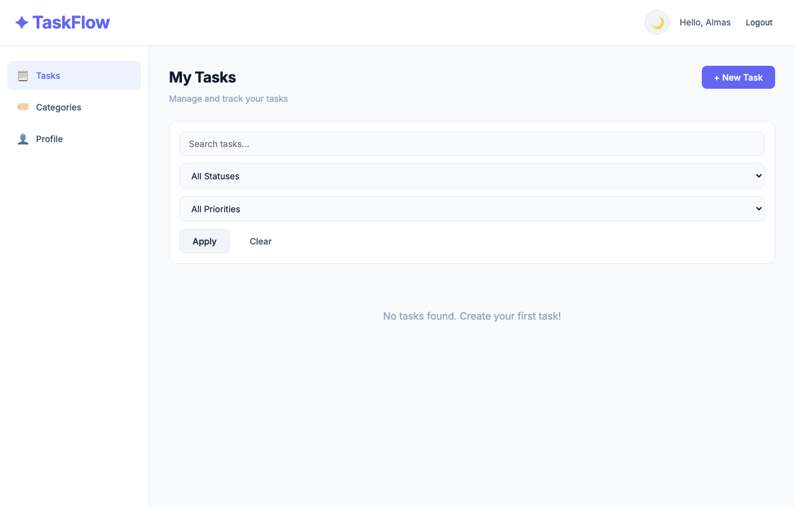
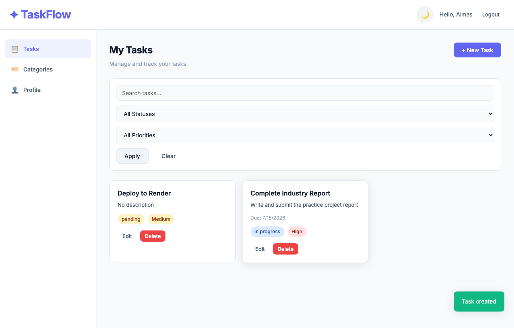
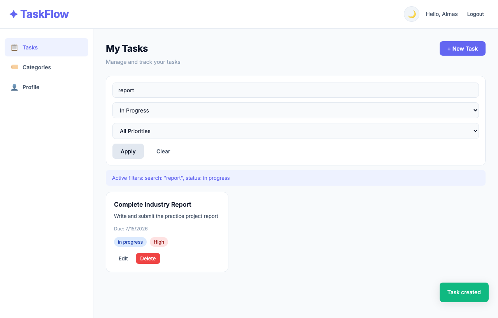
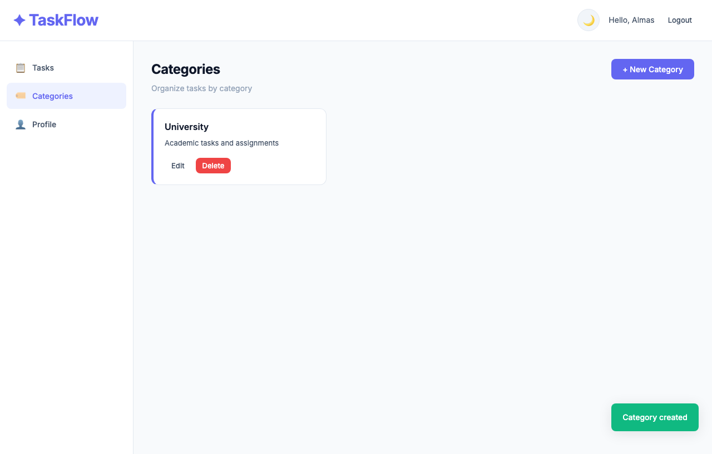
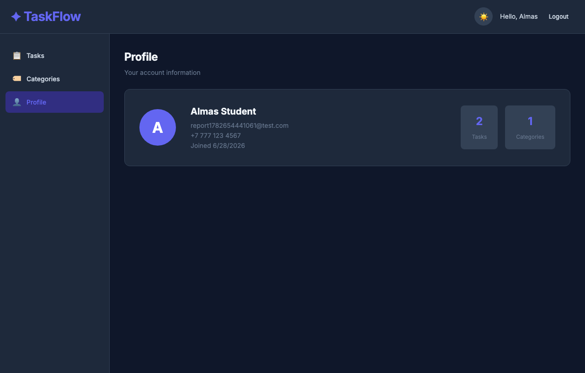
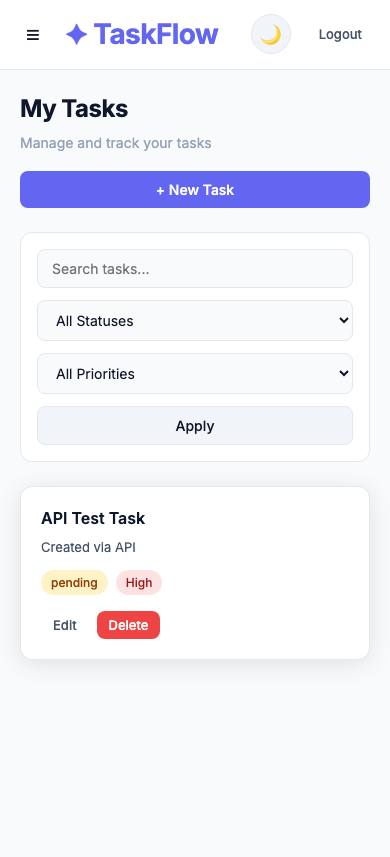
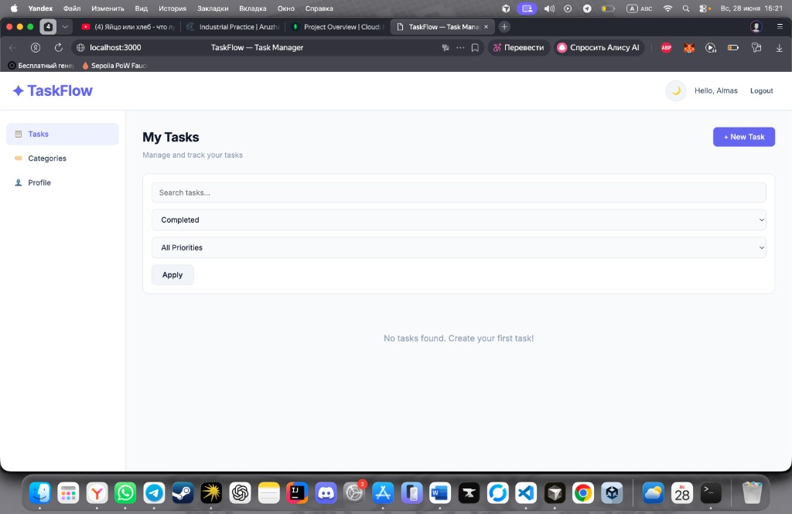
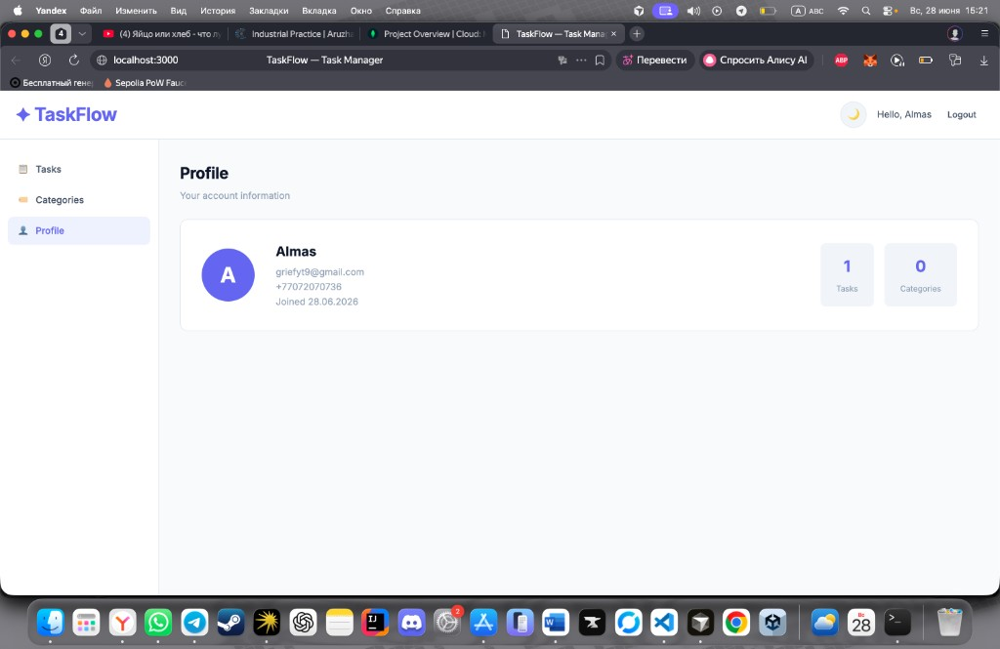

# TaskFlow — Industry Practice Project Report

**Student Name:** Alkhan Almas  
**Student Project:** Full-Stack Task Manager Application  
**Date:** June 28, 2026  
**Local URL:** http://localhost:3000  
**Deployment URL:** https://taskflow-alkhan.onrender.com  
**GitHub Repository:** https://github.com/AlmasAlkhan/Practice-work

---

## Table of Contents

1. [Project Overview](#1-project-overview)
2. [Setup Instructions](#2-setup-instructions)
3. [Database Schema](#3-database-schema)
4. [API Documentation](#4-api-documentation)
5. [Key Features Screenshots](#5-key-features-screenshots)
6. [Authentication and Security](#6-authentication-and-security)
7. [Validation and Error Handling](#7-validation-and-error-handling)
8. [Frontend Features](#8-frontend-features)
9. [Deployment](#9-deployment)
10. [Project Checklist](#10-project-checklist)

---

## 1. Project Overview

### 1.1 Description

**TaskFlow** is a full-stack web application for managing personal and professional tasks. Users can register, log in, create color-coded categories, and manage tasks with status, priority, and due dates. The application supports search, filtering, and pagination for efficient task browsing.

### 1.2 Problem Statement

People often lose track of tasks across different areas of life — work, study, and personal goals. TaskFlow solves this by providing a single, secure, responsive platform where users can organize tasks into categories, track progress, and quickly find what they need using search and filters.

### 1.3 Tech Stack

| Layer | Technology |
|-------|------------|
| Frontend | HTML5, CSS3, Vanilla JavaScript |
| Backend | Node.js, Express.js |
| Database | MongoDB with Mongoose ODM |
| Authentication | JSON Web Tokens (JWT) |
| Password Security | bcryptjs (12 salt rounds) |
| Validation | Joi |
| Environment Config | dotenv |

### 1.4 Project Structure

```
task-manager/
├── backend/
│   ├── src/
│   │   ├── config/         # Database connection
│   │   ├── controllers/    # Business logic
│   │   ├── middleware/     # Auth, validation, errors
│   │   ├── models/         # Mongoose schemas
│   │   ├── routes/         # API route definitions
│   │   ├── validators/     # Joi validation schemas
│   │   └── app.js          # Express application
│   ├── server.js           # Entry point
│   ├── package.json
│   └── .env
├── frontend/
│   ├── css/styles.css
│   ├── js/                 # api, auth, app, storage, validation
│   └── index.html
├── screenshots/            # Application screenshots
├── REPORT.md
└── README.md
```

### 1.5 Architecture Diagram

```
┌─────────────┐     HTTP/REST      ┌─────────────┐     Mongoose     ┌─────────────┐
│   Browser   │ ◄──────────────►  │   Express   │ ◄──────────────► │   MongoDB   │
│  (Frontend) │    JSON + JWT     │   (Backend) │                  │  (Database) │
└─────────────┘                   └─────────────┘                  └─────────────┘
```

---

## 2. Setup Instructions

### 2.1 Prerequisites

- **Node.js** 18 or higher (`node -v`)
- **npm** (`npm -v`)
- **MongoDB** — local via Homebrew or cloud via MongoDB Atlas

### 2.2 Installation

```bash
# 1. Navigate to backend
cd task-manager/backend

# 2. Install dependencies
npm install

# 3. Configure environment
cp .env.example .env
```

### 2.3 Environment Variables

| Variable | Description | Example |
|----------|-------------|---------|
| `PORT` | Server port | `3000` |
| `MONGODB_URI` | MongoDB connection string | `mongodb://localhost:27017/taskmanager` |
| `JWT_SECRET` | Secret key for JWT signing | `your_secret_key` |
| `JWT_EXPIRES_IN` | Token lifetime | `7d` |
| `NODE_ENV` | Environment mode | `development` |

> **Note:** On macOS, port 5000 is often used by AirPlay Receiver. This project uses port **3000** by default.

### 2.4 Start MongoDB

```bash
brew services start mongodb-community
```

If already running, you will see: `Service mongodb-community already started`.

### 2.5 Run the Application

```bash
npm start
```

Expected output:

```
MongoDB connected
Server running on port 3000
```

Open **http://localhost:3000** in your browser.

### 2.6 Test Account

| Field | Value |
|-------|-------|
| Email | `test@example.com` |
| Password | `Password1` |

Or register a new account via the Sign Up form.

---

## 3. Database Schema

The application uses **three related MongoDB collections** connected through references.

### 3.1 Entity Relationship

```
┌──────────┐       1:N        ┌────────────┐
│   User   │─────────────────►│  Category  │
└──────────┘                  └────────────┘
     │                               │
     │ 1:N                           │ 1:N
     ▼                               ▼
┌──────────┐◄────────────────────────┘
│   Task   │
└──────────┘
```

### 3.2 User Collection

| Field | Type | Required | Description |
|-------|------|----------|-------------|
| `name` | String | Yes | Full name (min 2 chars) |
| `email` | String | Yes | Unique, lowercase email |
| `password` | String | Yes | Hashed with bcrypt (min 8 chars) |
| `phone` | String | No | Optional phone number |
| `createdAt` | Date | Auto | Registration timestamp |
| `updatedAt` | Date | Auto | Last update timestamp |

### 3.3 Category Collection

| Field | Type | Required | Description |
|-------|------|----------|-------------|
| `name` | String | Yes | Category name |
| `color` | String | Yes | Hex color code (e.g. `#6366f1`) |
| `description` | String | No | Category description |
| `user` | ObjectId | Yes | Reference to User |
| `createdAt` | Date | Auto | Creation timestamp |
| `updatedAt` | Date | Auto | Last update timestamp |

### 3.4 Task Collection

| Field | Type | Required | Description |
|-------|------|----------|-------------|
| `title` | String | Yes | Task title |
| `description` | String | No | Task details |
| `status` | Enum | Yes | `pending`, `in_progress`, `completed` |
| `priority` | Enum | Yes | `low`, `medium`, `high` |
| `dueDate` | Date | No | Optional deadline |
| `user` | ObjectId | Yes | Reference to User |
| `category` | ObjectId | No | Reference to Category |
| `createdAt` | Date | Auto | Creation timestamp |
| `updatedAt` | Date | Auto | Last update timestamp |

---

## 4. API Documentation

### Base URL

```
http://localhost:3000/api
```

### Authentication Header

Protected endpoints require:

```
Authorization: Bearer <jwt_token>
```

---

### 4.1 Authentication Endpoints

#### POST `/api/auth/register`

Register a new user.

**Request:**
```json
{
  "name": "John Doe",
  "email": "john@example.com",
  "password": "Password1",
  "phone": "+1 555 123 4567"
}
```

**Response (201):**
```json
{
  "success": true,
  "message": "Registration successful",
  "data": {
    "user": {
      "name": "John Doe",
      "email": "john@example.com",
      "phone": "+1 555 123 4567",
      "_id": "6a40f129795882c2438bf2a0"
    },
    "token": "eyJhbGciOiJIUzI1NiIs..."
  }
}
```

#### POST `/api/auth/login`

**Request:**
```json
{
  "email": "test@example.com",
  "password": "Password1"
}
```

**Response (200):**
```json
{
  "success": true,
  "message": "Login successful",
  "data": {
    "user": {
      "_id": "6a40f129795882c2438bf2a0",
      "name": "Test User",
      "email": "test@example.com"
    },
    "token": "eyJhbGciOiJIUzI1NiIs..."
  }
}
```

#### GET `/api/auth/profile` _(protected)_

**Response (200):**
```json
{
  "success": true,
  "data": {
    "user": {
      "name": "Test User",
      "email": "test@example.com",
      "phone": "",
      "createdAt": "2026-06-28T10:02:17.698Z"
    },
    "stats": {
      "tasks": 1,
      "categories": 0
    }
  }
}
```

---

### 4.2 Task Endpoints _(protected)_

#### POST `/api/tasks`

Create a new task.

**Request:**
```json
{
  "title": "Complete project report",
  "description": "Write the industry practice report",
  "status": "pending",
  "priority": "high",
  "dueDate": "2026-07-01",
  "category": "64a1b2c3d4e5f6789012345"
}
```

**Response (201):**
```json
{
  "success": true,
  "data": {
    "title": "API Test Task",
    "description": "Created via API",
    "status": "pending",
    "priority": "high",
    "user": "6a40f129795882c2438bf2a0",
    "_id": "6a40f6395ac8ea3b139b59c7",
    "createdAt": "2026-06-28T10:23:53.939Z"
  }
}
```

#### GET `/api/tasks`

List tasks with **search**, **filter**, and **pagination**.

**Example:**
```
GET /api/tasks?search=API&status=pending&priority=high&page=1&limit=10
```

| Parameter | Description |
|-----------|-------------|
| `search` | Keyword search in title and description |
| `status` | Filter: `pending`, `in_progress`, `completed` |
| `priority` | Filter: `low`, `medium`, `high` |
| `page` | Page number (default: 1) |
| `limit` | Items per page (default: 10, max: 50) |

**Response (200):**
```json
{
  "success": true,
  "data": [
    {
      "_id": "6a40f6395ac8ea3b139b59c7",
      "title": "API Test Task",
      "description": "Created via API",
      "status": "pending",
      "priority": "high"
    }
  ],
  "pagination": {
    "page": 1,
    "limit": 10,
    "total": 1,
    "pages": 1
  }
}
```

#### PUT `/api/tasks/:id`

Update an existing task. Returns updated task object.

#### DELETE `/api/tasks/:id`

Delete a task. Returns confirmation message.

---

### 4.3 Category Endpoints _(protected)_

| Method | Endpoint | Description |
|--------|----------|-------------|
| POST | `/api/categories` | Create category |
| GET | `/api/categories` | List all user categories |
| PUT | `/api/categories/:id` | Update category |
| DELETE | `/api/categories/:id` | Delete category |

---

### 4.4 Health Check

#### GET `/api/health`

```json
{
  "success": true,
  "message": "Task Manager API is running"
}
```

---

## 5. Key Features Screenshots

> All screenshots are stored in the `screenshots/` folder.  
> For a PDF-ready version with embedded images, open **`REPORT_WITH_IMAGES.html`** in your browser.

### 5.1 Sign In Page

Authentication form with email and password validation.



### 5.2 Sign Up Page

Registration form with name, email, phone, and password complexity validation.



### 5.3 Tasks Dashboard

Main dashboard after login with sidebar navigation and task management interface.



### 5.4 Tasks with Data

Task cards displaying title, description, status badges, priority, and due date.



### 5.5 Search and Filtering

Search by keyword combined with status and priority filters. Clear button resets filters.



### 5.6 Categories Page

Color-coded category cards for organizing tasks.



### 5.7 Profile Page

User account information with task and category statistics.


### 5.8 Dark Mode

Light and dark theme toggle with preference saved in localStorage.



### 5.9 Mobile Responsive View

Fully functional layout on mobile devices (390px viewport).



### 5.10 Tasks Page — Live Session

Real application screenshot from user session (Almas).



### 5.11 Profile Page — Live Session

Profile dashboard showing user account and statistics.



---

## 6. Authentication and Security

| Feature | Implementation |
|---------|----------------|
| JWT Authentication | Token issued on register/login, expires in 7 days |
| Protected Routes | `auth` middleware on `/api/tasks` and `/api/categories` |
| Password Hashing | bcryptjs with 12 salt rounds via Mongoose pre-save hook |
| Environment Variables | `JWT_SECRET`, `MONGODB_URI` stored in `.env` |
| CORS | Enabled for cross-origin requests |
| User Isolation | All queries filtered by authenticated `user` ID |

### Security Flow

```
1. User registers → password hashed → JWT issued
2. Client stores token in localStorage
3. Each API request includes: Authorization: Bearer <token>
4. Middleware verifies token → attaches user to request
5. Controller queries only user's own data
```

---

## 7. Validation and Error Handling

### 7.1 Backend Validation (Joi)

| Field | Rules |
|-------|-------|
| Email | Valid email format |
| Password | Min 8 chars, uppercase + lowercase + number |
| Phone | Optional, 7–20 digits with `+`, spaces, dashes |
| Task title | Required, max 200 characters |
| Category name | Required, max 100 characters |

### 7.2 Frontend Validation

- Email format check on login and registration
- Password complexity check on registration
- Phone format validation (if provided)
- Required field validation on all forms

### 7.3 HTTP Status Codes

| Code | Usage |
|------|-------|
| 200 | Successful GET, PUT, DELETE |
| 201 | Successful POST (created) |
| 400 | Validation error, invalid ID |
| 401 | Missing or invalid JWT token |
| 404 | Resource or route not found |
| 409 | Duplicate email on registration |
| 500 | Internal server error |

### 7.4 Global Error Handler

Centralized `errorHandler` middleware catches:
- Mongoose validation errors → 400
- Duplicate key errors → 409
- Cast errors (invalid ObjectId) → 400
- JWT errors → 401

---

## 8. Frontend Features

### 8.1 Responsiveness

The application is fully responsive and tested on:
- **Desktop** — 1280px and above
- **Tablet** — 768px breakpoint with collapsible sidebar
- **Mobile** — 390px with hamburger menu navigation

### 8.2 Design Quality

- Professional Inter font typography
- Consistent color system with CSS custom properties
- Sufficient color contrast in both light and dark modes
- Status and priority badges with semantic colors
- No placeholder buttons — all UI elements are functional

### 8.3 User Features

| Feature | Description |
|---------|-------------|
| Sign Up | New user registration with validation |
| Sign In | Login with JWT token storage |
| Profile | Account info and statistics dashboard |
| Task CRUD | Create, read, update, delete tasks |
| Categories | Organize tasks with color-coded labels |
| Search | Keyword search across title and description |
| Filters | Filter by status and priority |
| Pagination | Page navigation with `page` and `limit` |
| Dark Mode | Theme toggle saved in localStorage |
| Filter Memory | Last search/filter config saved in localStorage |

### 8.4 localStorage Usage

| Key | Stored Data |
|-----|-------------|
| `taskflow_token` | JWT authentication token |
| `taskflow_theme` | `light` or `dark` theme preference |
| `taskflow_filters` | Last search query, status, priority, page |

---

## 9. Deployment

> **Important:** Deployment is worth **10 points**. The application is publicly accessible on Render.

### 9.1 Local Deployment (Development)

| Item | Value |
|------|-------|
| URL | http://localhost:3000 |
| Status | ✅ Running and tested |

### 9.2 Production Deployment (Render + MongoDB Atlas)

**Step 1 — MongoDB Atlas:**
1. Create free M0 cluster at [mongodb.com/atlas](https://www.mongodb.com/atlas)
2. Add database user with read/write permissions
3. Allow network access from `0.0.0.0/0`
4. Copy connection string

**Step 2 — GitHub:**
1. Push project to GitHub repository

**Step 3 — Render:**
1. Create new Web Service at [render.com](https://render.com)
2. Connect GitHub repository
3. Configure:

| Setting | Value |
|---------|-------|
| Root Directory | `backend` |
| Build Command | `npm install` |
| Start Command | `npm start` |

4. Set environment variables:

| Variable | Value |
|----------|-------|
| `MONGODB_URI` | Atlas connection string |
| `JWT_SECRET` | Strong random secret |
| `JWT_EXPIRES_IN` | `7d` |
| `NODE_ENV` | `production` |

**Deployment URL:**

```
https://taskflow-alkhan.onrender.com
```

**GitHub Repository:**

```
https://github.com/AlmasAlkhan/Practice-work
```

Author: **Alkhan Almas**

---

## 10. Project Checklist

| # | Requirement | Points | Status |
|---|-------------|--------|--------|
| 1 | Project setup with modular structure | 10 | ✅ |
| 2 | Database with 3 related entities | 10 | ✅ |
| 3 | API endpoints (auth, CRUD, search/filter/pagination) | 20 | ✅ |
| 4 | JWT, bcrypt, protected routes, .env | 15 | ✅ |
| 5 | Joi validation, error handling, form validation | 10 | ✅ |
| 6 | Responsive design, professional UI, dark mode | 15 | ✅ |
| 7 | Sign Up, Login, Profile, search, localStorage | 10 | ✅ |
| 8 | Deployment with public URL | 10 | ✅ https://taskflow-alkhan.onrender.com |
| | **Report with overview, setup, API docs, screenshots** | | ✅ Done |

---

## Conclusion

TaskFlow is a complete full-stack CRUD application developed by **Alkhan Almas** that meets all technical requirements of the Industry Practice Project. The application is deployed at **https://taskflow-alkhan.onrender.com** and the source code is available at **https://github.com/AlmasAlkhan/Practice-work**.

---

*Report prepared by Alkhan Almas — Industry Practice Project, Military Practice Students*
